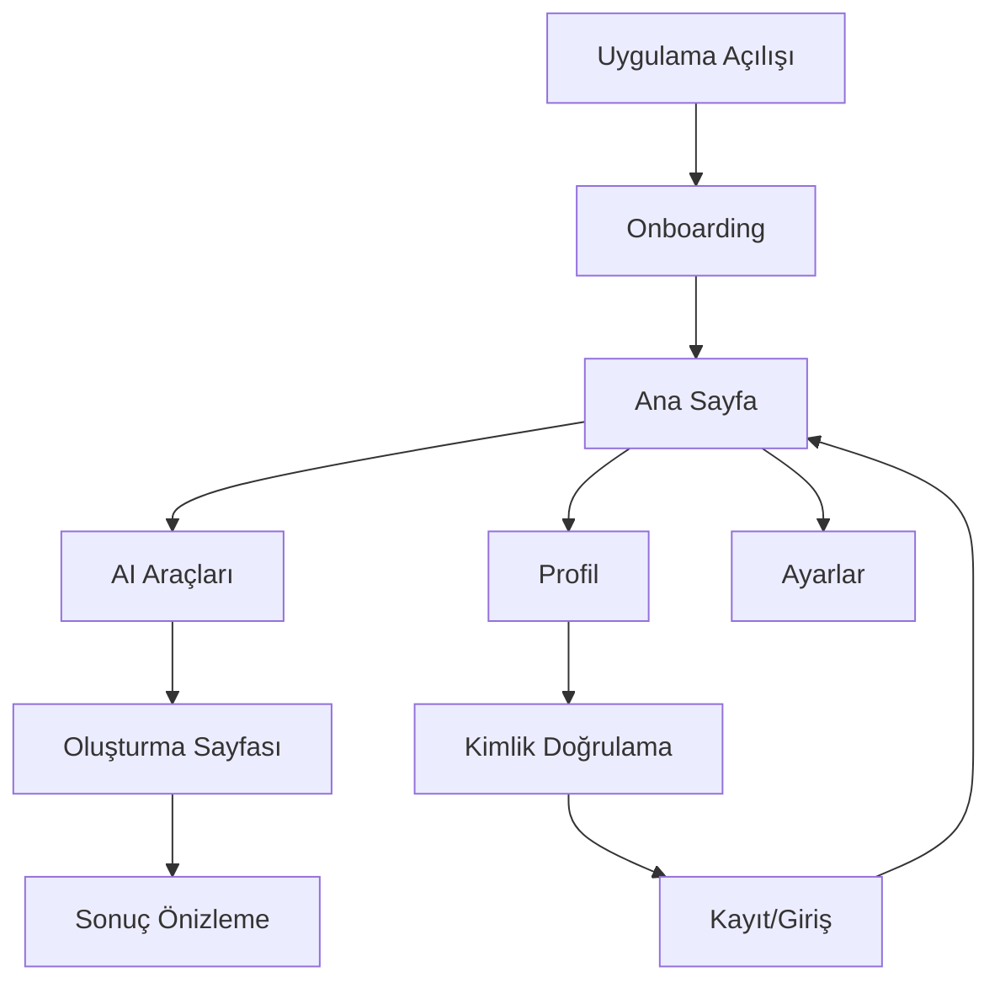

# AI Görsel Üretici Uygulaması - Geliştirme Gereksinimleri

## 1. Proje Genel Bakış

Mevcut AI görsel üretici uygulamasının eksikliklerinin giderilmesi ve kullanıcı deneyiminin iyileştirilmesi projesi. Uygulama React Native Expo teknolojisi ile geliştirilmiş olup, Firebase entegrasyonu, kullanıcı yönetimi, UI/UX iyileştirmeleri ve hata düzeltmeleri gerektirmektedir.

## 2. Temel Özellikler

### 2.1 Kullanıcı Rolleri

| Rol               | Kayıt Yöntemi                | Temel Yetkiler                                           |
| ----------------- | ---------------------------- | -------------------------------------------------------- |
| Misafir Kullanıcı | Uygulama açılışında otomatik | Temel özellikleri görüntüleme, sınırlı AI araç kullanımı |
| Kayıtlı Kullanıcı | Email/Google ile kayıt       | Tam AI araç erişimi, içerik kaydetme, profil yönetimi    |
| Premium Kullanıcı | Abonelik satın alma          | Sınırsız kredi, premium AI modelleri, öncelikli işlem    |

### 2.2 Özellik Modülleri

Uygulama geliştirme gereksinimleri aşağıdaki ana sayfalarda toplanmıştır:

1. **Ana Sayfa**: Hero bölümü, navigasyon menüsü, AI model kartları, hızlı erişim butonları
2. **AI Araçları Sayfası**: 2'li grid düzeni, araç kategorileri, görsel/video önizlemeleri
3. **Oluşturma Sayfası**: Hata düzeltmeleri, gelişmiş form kontrolleri, önizleme sistemi
4. **Onboarding Sayfası**: Kullanıcı tanıtımı, özellik açıklamaları, ilk kurulum
5. **Profil Sayfası**: Kullanıcı bilgileri, kredi durumu, ayarlar
6. **Kimlik Doğrulama Sayfası**: Giriş/kayıt formu, sosyal medya entegrasyonu
7. **Ayarlar Sayfası**: Uygulama tercihleri, hesap yönetimi, gizlilik ayarları

### 2.3 Sayfa Detayları

| Sayfa Adı        | Modül Adı             | Özellik Açıklaması                                               |
| ---------------- | --------------------- | ---------------------------------------------------------------- |
| Ana Sayfa        | Hero Bölümü           | Hoş geldin mesajı, kredi göstergesi, hızlı erişim butonları      |
| Ana Sayfa        | AI Model Kartları     | Popüler AI modelleri, kategori filtreleme, hızlı başlat          |
| Ana Sayfa        | Bottom Navigation     | 5 ana sekme: Ana Sayfa, AI Araçları, Oluştur, Profil, Ayarlar    |
| AI Araçları      | Grid Layout           | 2 sütunlu kart düzeni, görsel/video önizlemeleri                 |
| AI Araçları      | Kategori Filtreleri   | Tümü, Görsel Araçları, Video Araçları, Yaratıcı Araçlar          |
| AI Araçları      | Araç Kartları         | İkon, başlık, açıklama, örnek görsel/video, kredi maliyeti       |
| Oluşturma        | Form Kontrolleri      | Prompt girişi, görsel yükleme, kalite seçimi, stil seçenekleri   |
| Oluşturma        | Hata Yönetimi         | Span hatası düzeltme, form validasyonu, kullanıcı geri bildirimi |
| Oluşturma        | Önizleme Sistemi      | Gerçek zamanlı önizleme, sonuç galerisi, paylaşım seçenekleri    |
| Onboarding       | Tanıtım Slaytları     | Uygulama özellikleri, AI araçları tanıtımı, başlangıç rehberi    |
| Onboarding       | İlk Kurulum           | Hesap oluşturma teşviki, izin istekleri, tercih ayarlama         |
| Profil           | Kullanıcı Bilgileri   | Avatar, isim, email, üyelik durumu, istatistikler                |
| Profil           | Kredi Yönetimi        | Mevcut kredi, kullanım geçmişi, kredi satın alma                 |
| Profil           | İçerik Galerisi       | Oluşturulan görseller/videolar, favoriler, paylaşım seçenekleri  |
| Kimlik Doğrulama | Giriş Formu           | Email/şifre girişi, şifremi unuttum, sosyal medya girişi         |
| Kimlik Doğrulama | Kayıt Formu           | Email kayıt, şifre oluşturma, kullanım şartları onayı            |
| Kimlik Doğrulama | Firebase Entegrasyonu | Authentication servisi, Firestore veritabanı, güvenlik kuralları |
| Ayarlar          | Uygulama Tercihleri   | Tema seçimi, dil ayarları, bildirim tercihleri                   |
| Ayarlar          | Hesap Yönetimi        | Şifre değiştirme, hesap silme, veri dışa aktarma                 |

## 3. Temel Süreçler

### Misafir Kullanıcı Akışı

Misafir kullanıcı uygulamayı açtığında onboarding sürecinden geçer, temel özellikleri keşfeder ve sınırlı AI araçlarını kullanabilir. Daha fazla özellik için kayıt olmaya yönlendirilir.

### Kayıtlı Kullanıcı Akışı

Kayıtlı kullanıcı giriş yapar, tam AI araç erişimi elde eder, içerik oluşturur, profil yönetimi yapar ve kredi sistemi ile etkileşime geçer.

### Premium Kullanıcı Akışı

Premium kullanıcı sınırsız erişim elde eder, gelişmiş AI modelleri kullanır ve öncelikli işlem hizmeti alır.

## 4. Kullanıcı Arayüzü Tasarımı

### 4.1 Tasarım Stili

* **Ana Renkler**: Primary: #6C5CE7 (Mor), Secondary: #A78BFA (Açık Mor), Accent: #FF6B6B (Mercan)

* **Buton Stili**: Yuvarlatılmış köşeler (16px), gradient arka planlar, gölge efektleri

* **Font**: SF Pro Display (iOS), Roboto (Android), 14-24px arası boyutlar

* **Layout Stili**: Kart tabanlı tasarım, bottom navigation, grid düzenleri

* **İkon Stili**: Ionicons kütühanesi, 24px standart boyut, outline/filled varyantları

### 4.2 Sayfa Tasarım Genel Bakışı

| Sayfa Adı   | Modül Adı         | UI Elementleri                                                               |
| ----------- | ----------------- | ---------------------------------------------------------------------------- |
| Ana Sayfa   | Hero Bölümü       | Gradient arka plan, hoş geldin metni, kredi badge, hızlı erişim butonları    |
| Ana Sayfa   | AI Model Kartları | 2'li grid, gradient kartlar, model isimleri, açıklamalar, başlat butonları   |
| AI Araçları | Grid Layout       | 2 sütun düzeni, kart yüksekliği 160px, 16px boşluk, yuvarlatılmış köşeler    |
| AI Araçları | Araç Kartları     | Üst kısımda görsel/video, alt kısımda başlık ve açıklama, gradient arka plan |
| Oluşturma   | Form Alanları     | TextInput bileşenleri, placeholder metinler, validation mesajları            |
| Onboarding  | Slayt Tasarımı    | Tam ekran slaytlar, animasyonlu geçişler, ilerleme göstergesi                |
| Profil      | Kullanıcı Kartı   | Avatar, kullanıcı bilgileri, kredi göstergesi, istatistik kartları           |

### 4.3 Responsive Tasarım

Uygulama mobile-first yaklaşımı ile tasarlanmış olup, hem iOS hem Android platformlarında optimize edilmiştir. Touch etkileşimleri için minimum 44px dokunma alanları kullanılır.

## 5. Teknik Gereksinimler

### 5.1 Firebase Entegrasyonu

* Firebase Authentication kurulumu

* Firestore veritabanı yapılandırması

* Storage servisi entegrasyonu

* Security rules tanımlaması

### 5.2 Hata Düzeltmeleri

* Create sayfasındaki span component hatası

* Form validation iyileştirmeleri

* Navigation hataları

* Memory leak önlemleri

### 5.3 Performans İyileştirmeleri

* Image lazy loading

* Component memoization

* Bundle size optimizasyonu

* API call optimization

## 6. Geliştirme Öncelikleri

### Yüksek Öncelik

1. Create sayfası span hatası düzeltme
2. Bottom navigation eksik sekmelerin eklenmesi
3. Firebase Authentication kurulumu
4. AI Tools grid düzeni iyileştirmesi

### Orta Öncelik

1. Onboarding sistemi implementasyonu
2. Profil sayfası geliştirme
3. Görsel/video içerik ekleme
4. UI/UX iyileştirmeleri

### Düşük Öncelik

1. Premium özellikler
2. Gelişmiş animasyonlar
3. Sosyal medya entegrasyonu
4. Analytics entegrasyonu

